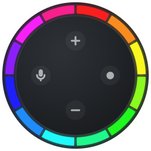
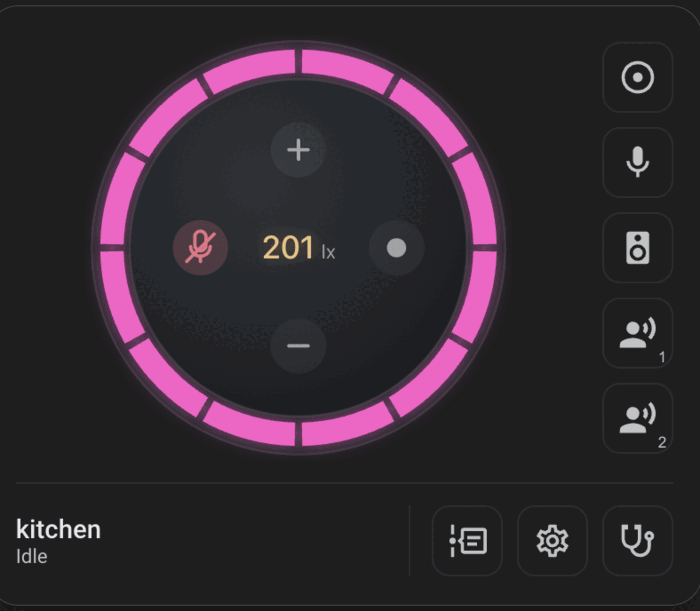
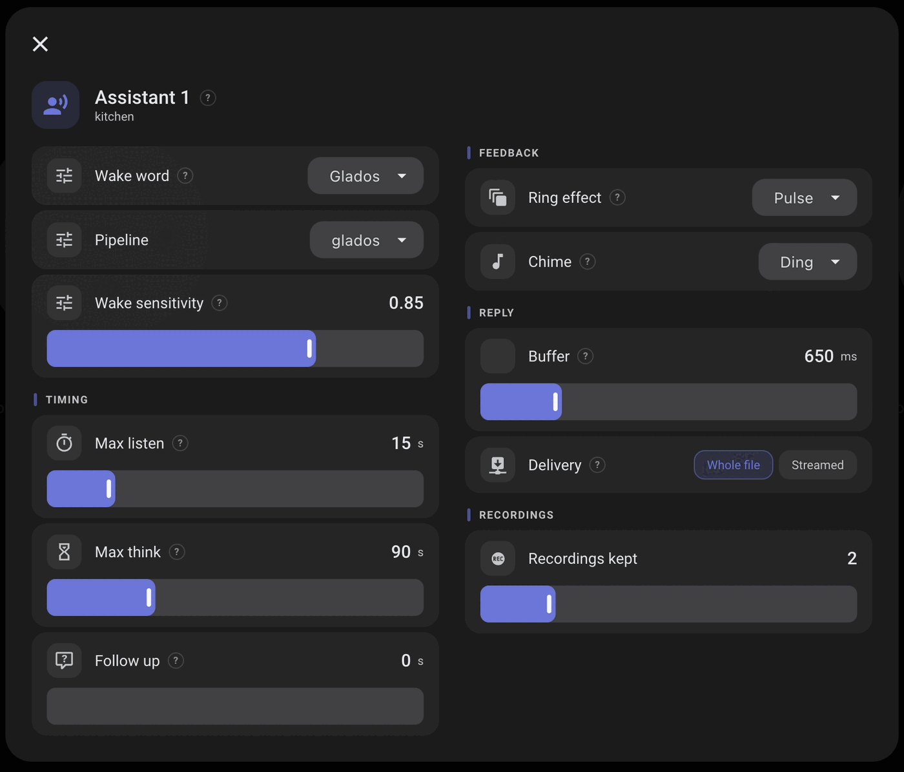
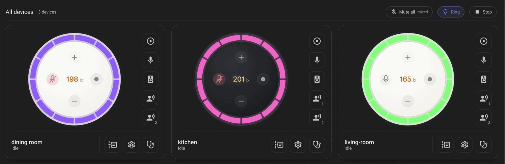
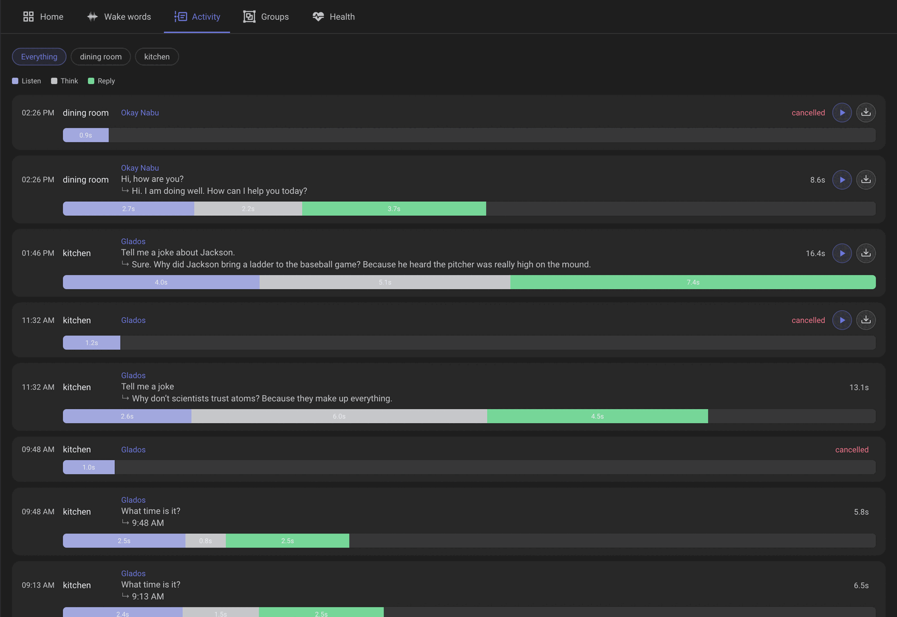
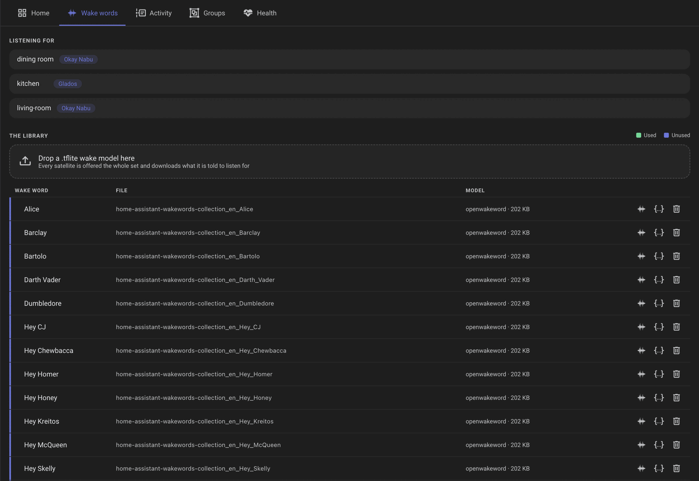

# EchoLocal for Home Assistant

  

[![hacs][hacs-badge]][hacs] 

An optional companion to [EchoLocal](https://github.com/ygelfand/echolocal), the firmware that turns an Amazon
Echo Dot Gen 2 into a Home Assistant voice satellite.

EchoLocal speaks the ESPHome native API, so Home Assistant already adopts a device, gives
it an assist satellite and an entity for every setting, with none of this installed. This adds integration things
on top:

- **A custom card** for the device with settings and controls
- **An optional dashboard** in the sidebar, with all the attached devices, as well as global settings
- **Extra functionality** the ESPHome protocol has no way to express
- more to come

## The card

Mimics a real device hardware, with device color detection, clickable action buttons, controllable lights

  

Additional popups for settings for individual components

  

## The dashboard

Optional, in the sidebar, with every satellite on one page

## The activity view

Every turn a device reports — what woke it, what it heard, what it answered, and how long each phase
took. Where a recording was kept, it plays back what the microphones actually sent.

A wake word library shared by every satellite. Drop in a `.tflite` to make it available to any

## Status

**Active development. Everything here is subject to change** — entity names, the card's config, the layout
of the dashboard, the lot.

## Installing

Needs Home Assistant **2025.11** or newer, which is where ESPHome learned to hand out custom wake words.

### HACS (custom repository)

Click the badge to add this repo to HACS in one step, or add it manually:

1. HACS → ⋮ → **Custom repositories**
2. Add `https://github.com/ygelfand/echolocal-hacs` with category **Integration**
3. Install **EchoLocal**, then restart Home Assistant

### Manual

Copy `custom_components/echolocal` into your Home Assistant `config/custom_components/` and restart.

### Then

Settings → **Devices & Services** → **Add Integration** → **EchoLocal**. There is nothing to configure but
whether you want the dashboard in the sidebar.

## Licence

MIT.

[hacs]: https://github.com/hacs/integration
[hacs-badge]: https://img.shields.io/badge/HACS-Custom-41BDF5.svg
